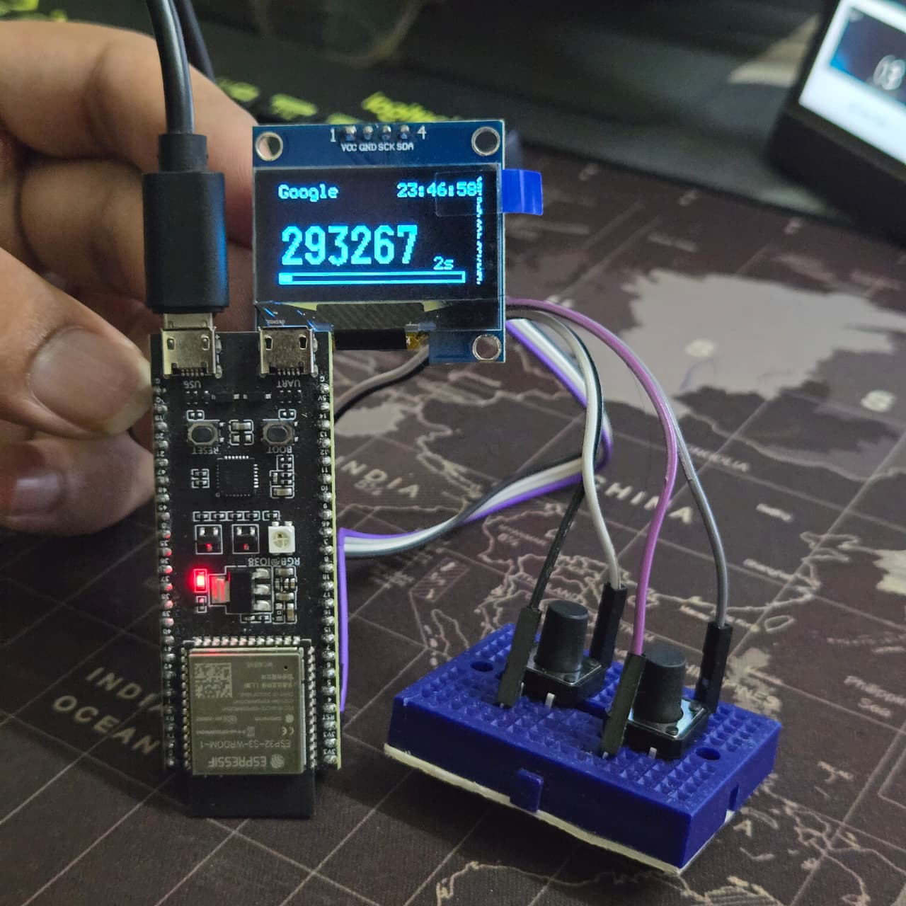
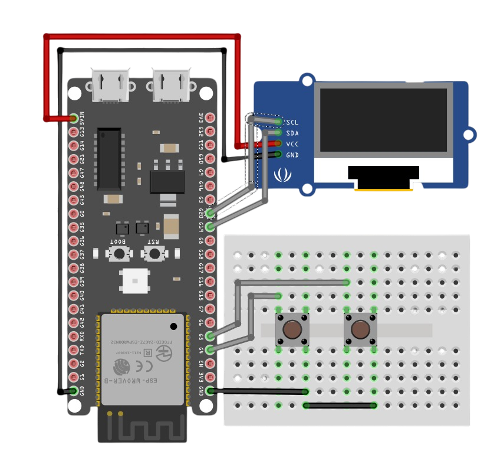

# ESP32 Hardware TOTP Generator

A standalone two-factor authentication (2FA) hardware token built using the **ESP32**, featuring OLED display, USB keyboard output, and secure time-based one-time password (TOTP) generation similar to Google Authenticator, but in hardware form.




---

## 🔧 Features

-  Generates 6-digit **TOTP codes** every 30 seconds  
-  Multiple account support (Google, GitHub, Work, etc.)  
-  Syncs accurate time via **NTP over Wi-Fi**  
-  Displays OTPs on **OLED screen** with a progress bar  
-  Sends OTP via **USB HID keyboard** on button press  
---

## 🧠 How It Works

1. Connect ESP32 to Wi-Fi (for NTP time sync)  
2. Device calculates TOTP using **HMAC-SHA1** and secret key  
3. Each 30-second window generates a new OTP  
4. OLED shows active code + remaining time bar  
5. Press the button to “type” OTP into your login screen automatically  

---

## 🧰 Hardware Setup



| Component | Pin | Description |
|------------|-----|-------------|
| OLED SDA   | 8   | I²C Data    |
| OLED SCL   | 9   | I²C Clock   |
| Button 1   | 4   | Switch account |
| Button 2   | 5   | Paste OTP |
| ESP32 Board | - | ESP32-S3 or ESP32 DevKit |

---

## 🧩 Libraries Used

- `WiFi.h`
- `lwip/apps/sntp.h`
- `mbedtls/md.h`
- `U8g2lib.h`
- `Wire.h`
- `USB.h`
- `USBHIDKeyboard.h`

Install these via Arduino Library Manager or PlatformIO.

---

## ⚙️ Installation

1. Clone this repo:
   ```bash
   git clone https://github.com/x4r5h/Hardware-TOTP.git
   ```
2. Open totpgen.ino in Arduino IDE.
3. Install required libraries.
4. Flash the code to your ESP32.
5. Connect to Wi-Fi (SSID & password can be configured in code).
6. Watch your first OTP appear on OLED 🎉
---
## 📷 Demo

