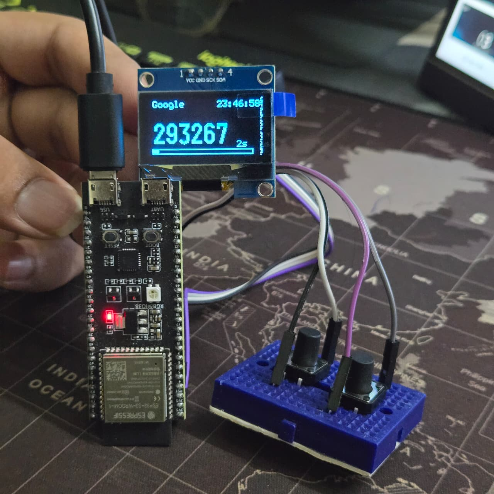
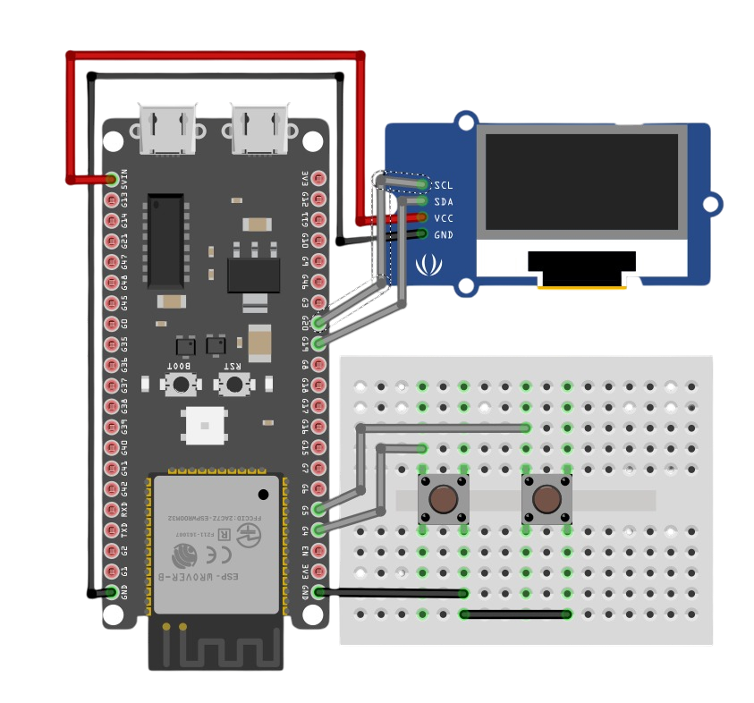

# Hardware TOTP Generator

A physical two-factor authentication device built on ESP32-S3. Generate time-based one-time passwords without needing your phone - just press a button and it types the OTP directly via USB.



---

## Features

- **Standalone operation** - No phone or computer required
- **USB HID keyboard** - Types OTP codes directly into any input field
- **Multi-account support** - Store up to 10 TOTP accounts
- **Offline capable** - Maintains accurate time with optional RTC module
- **Zero-config setup** - Captive portal web interface for easy configuration
- **Secure storage** - AES-256 encrypted secrets in flash memory
- **Real-time display** - Shows current code with countdown timer

---

## Hardware Requirements

- **ESP32-S3** DevKit (USB-native, WiFi enabled)
- **128x64 OLED** display (I2C, SSD1306)
- **2x Push buttons** (GPIO with internal pullup)
- **DS3231 RTC** module (optional - enables offline operation)

### Pinout



| Component | GPIO Pin | Function |
|-----------|----------|----------|
| OLED SDA  | 8        | I²C Data |
| OLED SCL  | 9        | I²C Clock |
| BTN_NEXT  | 4        | Cycle through accounts |
| BTN_PASTE | 5        | Type current OTP |
| RTC (opt) | 8, 9     | Shared I²C bus |

---

## Installation

### Prerequisites

Install via Arduino Library Manager:
- **RTClib** by Adafruit (for DS3231 RTC support)
- **U8g2** (for OLED display)

All other libraries are included with ESP32 core.

### Upload

1. Clone this repository
2. Open `totpgen.ino` in Arduino IDE
3. Select **ESP32S3 Dev Module** as board
4. Configure USB settings:
   - USB CDC On Boot: **Enabled**
   - USB Mode: **Hardware CDC and JTAG**
5. Upload to device

See [BUILD.md](docs/BUILD.md) for detailed compilation instructions.

---

## Setup

### First Time Configuration

1. Power on device while holding **both buttons**
2. Device enters setup mode - OLED shows WiFi credentials
3. Connect to WiFi network: `TOTP-Setup-XXXX` (password: `totpsetup`)
4. Browser automatically opens configuration page (or navigate to 192.168.4.1)
5. Configure WiFi credentials
6. Add TOTP accounts (Base32 secrets)
7. Device automatically reboots and connects to configured WiFi

### Normal Operation

- **NEXT button** - Cycle through saved accounts
- **PASTE button** - Type current OTP code via USB
- **Display** - Shows account name, 6-digit code, and countdown bar

---

## Architecture

### Core Components

```
totpgen.ino          - Main program loop and initialization
config.h             - Hardware pin definitions and constants
totp_core.cpp/h      - TOTP/HOTP algorithm implementation
storage.cpp/h        - Encrypted NVS storage manager
rtc_manager.cpp/h    - Time source arbitration (NTP/RTC)
web_provision.cpp/h  - Captive portal configuration interface
buttons.cpp/h        - Debounced button input handling
display_ui.cpp/h     - OLED rendering functions
```

### Tech Stack

**Cryptography:** HMAC-SHA1, Base32 encoding, AES-256 encryption
**Networking:** WiFi (STA/AP), NTP, DNS, HTTP server
**Storage:** ESP32 NVS (Non-Volatile Storage) with encryption
**Hardware:** I2C (OLED + RTC), USB HID, GPIO interrupts

### How It Works

1. **Time sync** - Obtains accurate time via NTP over WiFi
2. **RTC backup** - Syncs DS3231 RTC module for offline operation
3. **TOTP generation** - Computes HMAC-SHA1(secret, time/30) → 6-digit code
4. **Display update** - Refreshes OLED with current code and progress bar
5. **USB output** - Emulates keyboard to type OTP when button pressed

---

## Security

- **AES-256 encryption** - All TOTP secrets encrypted at rest
- **Device-unique keys** - Encryption key derived from ESP32 MAC address
- **NVS storage** - Wear-leveled flash memory with built-in checksums
- **No cloud dependency** - All data stored locally on device

### Production Deployment

For additional security in production environments:
- Enable ESP32 **flash encryption**
- Enable **secure boot**
- Use hardware-backed eFuse keys
- Implement HTTPS for web interface

See [BUILD.md](docs/BUILD.md) for flash encryption setup.

---

## Demo


---

## License

MIT License - Do whatever you want to do with it
